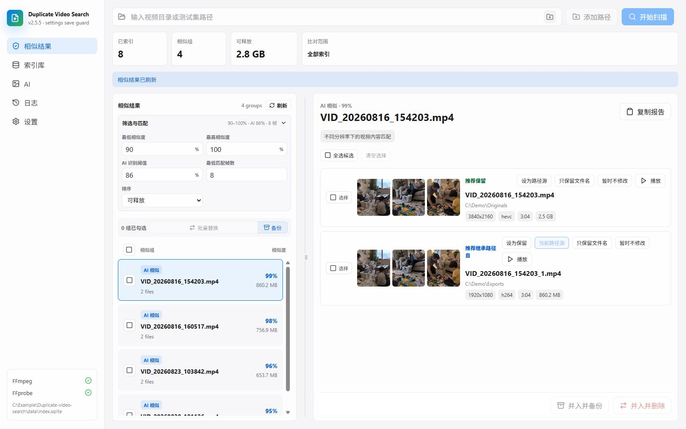
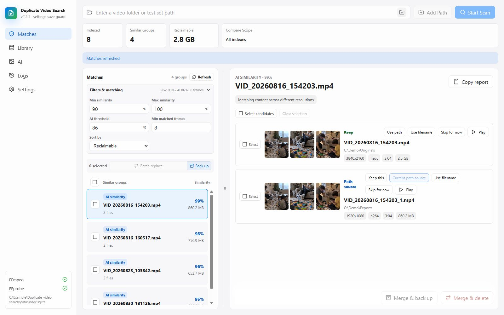

# Duplicate Video Search

**语言 / Language:** [中文](#中文) | [English](#english)

---

## 中文



*AI 生成的假想使用界面，所有文件名、缩略图和数据均为虚构；不是实际运行截图，具体界面以软件为准。*

Duplicate Video Search 是一个本地视频查重工具，用来整理电脑或 SMB 共享中的重复视频、相似转码和疑似剪辑片段。使用 React + Tauri + Rust，AI 推理在本机完成。

**当前源码版本：2.5.5。支持 Windows x64；本仓库提供源码，不附带模型、FFmpeg 或预编译安装包。**

### 适合谁用

- 同一批视频保存了多个清晰度、编码或不同文件名的版本。
- 希望比较画面内容，而不仅是文件名和文件大小。
- 需要保留较好的视频，同时继承另一份文件的目录或命名。
- 视频在本地磁盘或 Windows 可以访问的 SMB 共享中。

### 主要功能

- **本地 AI 比对：** ONNX 视觉模型提取帧特征，比较同源视频和疑似片段；支持 DirectML GPU 加速及 CPU 路径。
- **索引复用：** SQLite 保存元数据、缩略图和 AI 特征，支持多路径索引、重扫、重建和清理缓存。
- **同文件夹比对：** 可只比较直接父文件夹相同的视频；子文件夹单独处理。传统 CLI 比对、AI 候选和缓存结果均受此设置约束。
- **人工复核：** 查看相似度、视频参数与保留建议，手动指定保留项、路径来源和命名来源。
- **文件整理：** 支持备份、替换、合并及批量处理；操作历史中可回滚符合条件的操作。直接删除不能回滚。
- **性能设置：** 可调整抽帧、推理和匹配并发，使用本地磁盘缓存或 ImDisk 内存盘。
- **中英文界面：** 默认中文，可在设置中切换英文。

### 默认设置

| 设置项 | 默认值 | 说明 |
| --- | --- | --- |
| 只比对同文件夹内文件 | 关闭 | 开启后按直接父目录限制；旧配置缺少该字段时也默认关闭 |
| 锁定在测试路径 | 开启 | 允许项目 `samples` 目录及示例路径 `\\EXAMPLE-NAS\Test`；扫描自己的路径前需在设置中关闭 |
| 直接删除 | 关闭 | 建议先通过备份操作验证结果 |
| 扫描后建立 AI 索引 | 开启 | 需要先准备兼容模型 |
| AI 模型 | `models\dinov2-small-dynamic\model.onnx` | 模型需自行下载 |
| 内存缓存盘 | 开启，16 GiB | 首次使用需在设置中配置；也可关闭并指定可写的本地缓存目录 |
| 一级 / 二级缓存目录 | `Z:\TEMP` / `D:\TEMP` | 通用预设，使用前按实际磁盘修改；关闭内存盘后也应修改一级目录 |
| NAS SSH 预处理 | 关闭 | 当前版本加载设置时会强制关闭，暂不作为可用功能发布 |

### 安装与运行

准备以下依赖：

1. Windows 10/11 x64、Node.js（可使用 22 LTS 系列）与 npm、Rust stable MSVC 工具链。
2. Visual Studio C++ Build Tools（含 Windows SDK）和 Microsoft Edge WebView2。参照 [Tauri Windows 环境说明](https://v2.tauri.app/start/prerequisites/#windows)。
3. [FFmpeg 和 FFprobe](https://ffmpeg.org/download.html)：把两者所在目录加入 `PATH`，或设置 `DVS_FFMPEG`、`DVS_FFPROBE` 为各自完整路径。建议使用静态构建。
4. AI 模型：从 [Xenova/dinov2-small 的 ONNX 目录](https://huggingface.co/Xenova/dinov2-small/tree/main/onnx)下载 **`model.onnx`**，放入 `models\dinov2-small-dynamic\model.onnx`。具体要求见 [模型说明](models/README.md)。
5. 如果启用内存盘，安装 [ImDisk Toolkit](https://sourceforge.net/projects/imdisk-toolkit/)，并在软件设置中完成需要管理员权限的配置。使用普通磁盘缓存时无需 ImDisk。

在 PowerShell 中运行：

```powershell
git clone https://github.com/ShingenF/Duplicate-video-search.git
cd Duplicate-video-search
npm.cmd ci
npm.cmd run dev
```

生成桌面可执行文件：

```powershell
npm.cmd run build:exe
```

输出位于 `src-tauri\target\release\duplicate-video-search.exe`。如运行库以 DLL 形式生成，分发时需要同时携带构建输出中的 ONNX Runtime / DirectML 依赖；本仓库不承诺单文件免依赖运行。`npm.cmd run build` 可生成 NSIS 安装包，输出在 `src-tauri\target\release\bundle\nsis`。

`npm.cmd run dev:web` 只提供浏览器界面预览，使用模拟数据，不能真正扫描或整理本地文件。

### 使用方法

1. 打开设置，检查 FFmpeg、模型路径、备份目录和缓存目录。
2. 首次使用时配置内存盘，或关闭内存盘并选取有足够空间的本地缓存目录。
3. 关闭“锁定在测试路径”，添加自己的视频目录。SMB 共享需事先在 Windows 中完成登录并能正常访问。
4. 扫描后等待 AI 索引完成，在索引库中选择参与比对的路径。
5. 如果不希望跨文件夹比较，打开“只比对同文件夹内文件”，保存设置并刷新结果。
6. 检查相似组和保留建议，再执行备份或替换。先用少量可备份的视频验证流程。

相似度是候选线索，不保证两个视频完全相同；裁剪、片头片尾、字幕、水印和抽帧位置均可能影响结果。分段文件哈希也不等于完整逐字节校验。

### 命令行与开发

```powershell
npm.cmd run build:web
cargo test --manifest-path src-tauri/Cargo.toml --locked
cargo build --manifest-path src-tauri/Cargo.toml --release --bin dvs-cli --locked
.\src-tauri\target\release\dvs-cli.exe status
.\src-tauri\target\release\dvs-cli.exe scan "C:\Videos"
.\src-tauri\target\release\dvs-cli.exe ai-index
.\src-tauri\target\release\dvs-cli.exe ai-groups 0.90
```

CLI 使用同一套设置和索引；启用内存盘时，包括 `status` 在内的命令都会先检查并挂载已配置的内存盘，结束时释放。首次运行 CLI 前请在 GUI 完成配置。传统哈希比对可使用 `groups`；桌面结果主要采用 AI 流程。CLI 还包含文件变更命令，使用前应阅读参数处理代码。

### 隐私与数据保存

- 视频分析和模型推理在本机执行，没有云端推理或遥测上传代码。依赖、模型和驱动的下载需要联网；访问 SMB 共享也会使用网络。
- 配置、数据库、缩略图、缓存、备份及操作记录位于 `data/`，这些文件可能包含完整视频路径和私人信息，不要公开上传。
- 开发运行时数据位于项目目录；独立可执行文件通常使用其所在目录。可设置 `DVS_HOME` 指定应用工作目录（需要可写，模型相对路径也以此为基准）。
- `data/settings.json` 是普通本地 JSON 文件，不是加密凭据库。遗留 NAS 密码字段若写入会随配置保存，请勿在提交、日志或 Issue 中公开此文件。
- 发布源码不包含个人配置、真实媒体、数据库、日志、任务记录、工具二进制和模型权重。设置字段说明见 [配置说明](docs/CONFIGURATION.md)。

### 常见问题

**提示路径不允许访问**：在设置中关闭测试路径锁定，并检查 Windows 文件或 SMB 权限。

**提示内存缓存盘未配置**：先在设置中完成配置；不想使用内存盘时关闭它，并把缓存路径改到真实可写目录。

**模型没有就绪 / GPU 不可用**：检查模型位置、ONNX 格式、DirectML 驱动及运行库。可将 AI 设备改为 `cpu`，降低批量与并发后重试。

**macOS / Linux 能用吗？** 当前代码包含 Windows 文件对话框、命令及 ImDisk/DirectML 集成，未提供经过验证的跨平台桌面支持。

---

## English



*AI-generated concept illustration with fictional filenames, thumbnails, and data. This is not an actual application screenshot; the shipped interface may differ.*

Duplicate Video Search is a local video deduplication tool for Windows and accessible SMB shares. It uses React, Tauri, Rust, SQLite, and local ONNX inference to find duplicates, alternate encodes, and possible clips.

**Source version: 2.5.5. Windows x64 only. This repository does not include models, FFmpeg, or prebuilt installers.**

### Features

- Local AI frame embeddings with DirectML GPU acceleration and a CPU path.
- Reusable video indexes, thumbnails, model features, multi-folder scans, and cache cleanup.
- Optional same-folder matching: only files with the same immediate parent directory are compared; child folders remain separate. Applies to traditional CLI matching, AI candidates, and cached results. **Off by default, including older settings files.**
- Review similarity, technical details, and keeper suggestions; choose naming/path sources manually.
- Backup, replace, merge, and batch operations with history. Eligible operations can be rolled back; direct deletion cannot.
- Configurable workers, ordinary disk caches or ImDisk RAM caching, and Chinese/English UI.

### Requirements and installation

Use Windows 10/11 x64, Node.js with npm (22 LTS series is suitable), Rust stable MSVC, Visual Studio C++ Build Tools with Windows SDK, and WebView2. See the [Tauri prerequisites](https://v2.tauri.app/start/prerequisites/#windows).

Install [FFmpeg and FFprobe](https://ffmpeg.org/download.html), preferably static builds, and add them to `PATH` or set full executable paths in `DVS_FFMPEG` and `DVS_FFPROBE`. Download `model.onnx` from [Xenova/dinov2-small](https://huggingface.co/Xenova/dinov2-small/tree/main/onnx) into `models/dinov2-small-dynamic/model.onnx`; see [model requirements](models/README.md).

```powershell
git clone https://github.com/ShingenF/Duplicate-video-search.git
cd Duplicate-video-search
npm.cmd ci
npm.cmd run dev
```

Build with `npm.cmd run build:exe`; the executable is under `src-tauri/target/release`. Keep any generated ONNX Runtime / DirectML DLL dependencies with it. `npm.cmd run build` builds an NSIS installer. Browser-only `npm.cmd run dev:web` uses mock data and cannot scan or modify files.

### First use and defaults

1. Check the model, FFmpeg, backup directory, and cache settings.
2. RAM caching defaults to 16 GiB and requires [ImDisk Toolkit](https://sourceforge.net/projects/imdisk-toolkit/) plus elevated setup in Settings. Alternatively, disable RAM caching and choose writable ordinary disk cache folders. Initial cache paths are `Z:\TEMP` and `D:\TEMP`; adjust them for your machine.
3. Disable the test-path restriction before selecting real folders. The initial restriction only permits project `samples` and the illustrative `\\EXAMPLE-NAS\Test` path. Authenticate SMB access in Windows first.
4. Scan, wait for AI indexing, select library sources, and review the results. Enable same-folder matching if desired, save, and refresh.
5. Verify candidates before backup/replacement. Direct deletion is disabled by default and irreversible when enabled.

The legacy NAS SSH module is present but settings loading currently forces it off. It is not advertised as an available feature. macOS/Linux desktop support is unverified and requires Windows-specific integrations to be ported.

### CLI and verification

Run `npm.cmd run build:web` and `cargo test --manifest-path src-tauri/Cargo.toml --locked` to verify a build. Build the CLI with `cargo build --manifest-path src-tauri/Cargo.toml --release --bin dvs-cli --locked`. Commands include `status`, `scan "C:\Videos"`, `ai-index`, `ai-groups 0.90`, and traditional `groups`.

CLI commands share GUI settings. When RAM caching is enabled, every command (including `status`) activates the configured disk before execution and releases it afterward. Complete GUI setup first. Review the CLI source before using its file-changing commands.

### Privacy and limitations

Inference runs locally with no cloud inference or telemetry upload code. Dependency/model/driver downloads and SMB access use the network. Settings, indexes, thumbnails, caches, backups, and operation logs stay in `data/`; they may contain private paths. Do not publish them. `DVS_HOME` overrides the writable application home and the base for relative model paths.

`data/settings.json` is plain JSON, not an encrypted credential vault; legacy NAS credentials, if supplied, are stored there. See [configuration notes](docs/CONFIGURATION.md). Model weights, external binaries, media, runtime data, and personal task records are excluded from the source publication.

Similarity is a review signal, not proof of identical content. Sampled hashes are not full byte-for-byte verification. Review important files and use backups before destructive operations.
